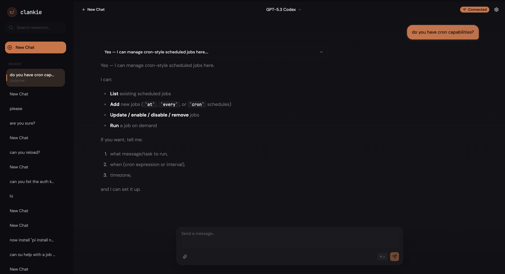
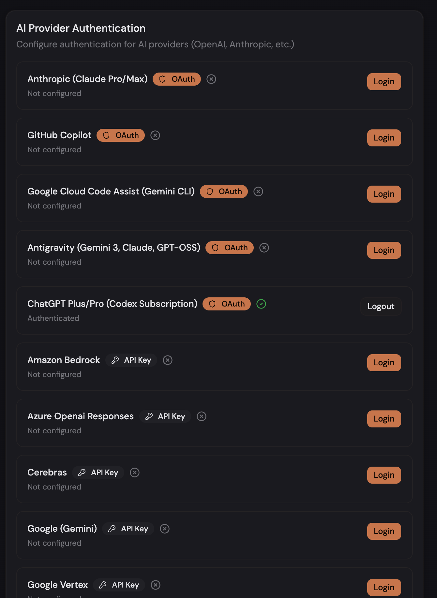
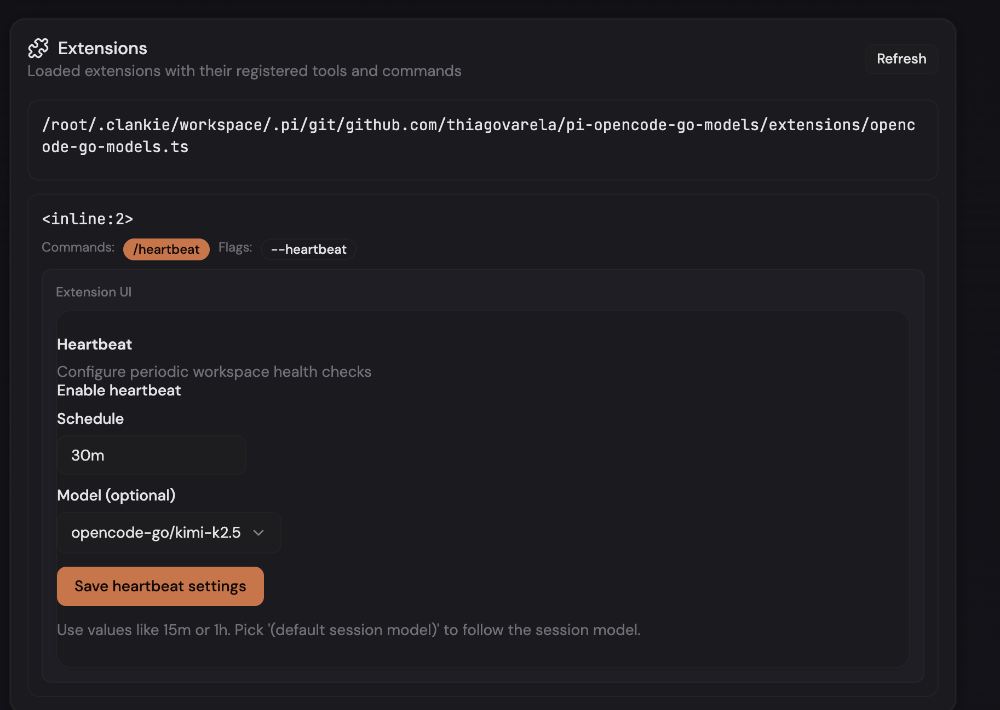

# clankie — Personal AI Assistant

A minimal AI assistant built on [pi](https://github.com/badlogic/pi-mono)'s SDK. clankie runs on your machine with your credentials, with a web channel today and support for additional channels via extensions.

## What Can clankie Do?

- 🌐 **Web UI** — Browser-based chat interface with real-time streaming ([web-ui/](./web-ui/))
- 📎 **Handle attachments** — Upload images (vision models), documents, code files
- 🔄 **Session management** — Switch between conversations with `/switch`, `/sessions`, `/new` commands
- 🔌 **pi ecosystem** — Works with pi extensions, skills, and prompt templates
- 🧩 **Extension UI Spec** — Declarative UI for extensions (forms, switches, selects) rendered in the browser
- 🔐 **API Provider Auth** — Configure OAuth and API keys for AI providers through the Web UI
- 🔒 **Privacy-first** — Runs on your machine, your credentials, your data

## Installation

### 1. Install Dependencies

**Runtime:** [Node.js](https://nodejs.org) v18+

```bash
# Check Node version
node --version  # Should be >= v18.0.0
```

### 2. Quick Install via npm

```bash
npm install -g clankie
```

### 3. Or: Install from Source

```bash
git clone https://github.com/thiagovarela/clankie
cd clankie
npm install
npm link
```

## Quick Start

```bash
clankie init
clankie login
clankie start
```

`clankie init` also creates default context files (`AGENTS.md`, `IDENTITY.md`, `SOUL.md`, `USER.md`) if missing.

You should see output like:

```text
[daemon] Starting clankie daemon (pid 12345)...
[daemon] Workspace: /Users/you/.clankie/workspace
[daemon] Channels: web
[web] WebSocket server listening on port 3100
[daemon] Ready. Waiting for messages...
```

Then open the connect URL printed by the daemon.

## Screenshots

### Chat view



### API provider auth



### Extensions UI



## Using clankie

### Web UI

1. Start the daemon: `clankie start`
2. Open the connect URL from logs (or use `http://localhost:3100?token=<your-token>`)
3. Start chatting

### Settings Pages

The Web UI includes built-in settings pages accessible from the sidebar:

**Authentication** (`/settings/auth`)  
Configure AI provider credentials:
- OAuth login for supported providers (Anthropic, OpenAI, GitHub Copilot, etc.)
- API key entry for providers that support direct authentication
- View and manage existing authentications

**Extensions** (`/settings/extensions`)  
Browse and configure loaded extensions:
- View registered tools, commands, flags, and shortcuts
- Interactive configuration forms for extensions with UI Spec
- Install new packages via chat commands

### Session Management Commands

When chatting through channels, you can use:

```text
/switch <name>    Switch to a different session
/sessions         List all sessions
/new              Start a fresh session (clears context)
```

### CLI Commands

```bash
# Send a one-off message (prints response and exits)
clankie send "What files are in the current directory?"

# Shorthand (no subcommand needed)
clankie "Summarize recent git commits"

# Check daemon status
clankie status

# Update clankie and restart daemon/service if needed
clankie self-update

# Stop daemon
clankie stop

# View configuration
clankie config show

# Reset AGENTS.md / IDENTITY.md / SOUL.md / USER.md to defaults
clankie agents reset
```

## Configuration

Config file: `~/.clankie/clankie.json` (JSON5 format — comments and trailing commas allowed)

### Common Settings

```bash
# Web channel
clankie config set channels.web.authToken "your-secret-token"
clankie config set channels.web.port 3100

# Optional: same-origin static hosting from daemon
clankie config set channels.web.staticDir "/path/to/web-ui/.output/public"

# AI model
clankie config set agent.model.primary "anthropic/claude-sonnet-4-5"

# Workspace (where agent works)
clankie config set agent.workspace "~/projects"
```

### Default Context Files (OpenClaw-style)

clankie ships built-in context templates owned by the `agent-context-files` extension.

Created by `clankie init` (if missing):

- `~/.clankie/workspace/AGENTS.md` (loaded natively by pi)
- `~/.clankie/IDENTITY.md`
- `~/.clankie/workspace/SOUL.md`
- `~/.clankie/workspace/USER.md`

`clankie agents reset` rewrites all of the files above to clankie defaults.

Prompt loading order for extension-managed files:

- `IDENTITY.md` → `SOUL.md` → `USER.md`

### Config Reference

| Path | Description | Example |
|------|-------------|---------|
| `agent.workspace` | Agent working directory | `"~/projects"` |
| `agent.model.primary` | Primary AI model | `"anthropic/claude-sonnet-4-5"` |
| `channels.web.authToken` | Web auth token | `"your-secret-token"` |
| `channels.web.port` | Web channel port | `3100` |
| `channels.web.allowedOrigins` | Allowed origins (optional) | `["https://example.com"]` |
| `channels.web.staticDir` | Static web-ui directory (optional) | `"/path/to/web-ui-dist"` |
| `channels.web.enabled` | Enable/disable web channel | `true` (default) |

## Running as a Service

```bash
clankie daemon install
clankie daemon status
clankie daemon logs
clankie daemon uninstall
```

## Development

```bash
npm run dev send "hello"
npm run build
npm run check
npm run check:fix
npm run format
```

## Troubleshooting

### "No channels configured" error

Configure the web channel:

```bash
clankie config set channels.web.authToken "your-secret-token"
clankie config set channels.web.port 3100
```

### Daemon won't start after reboot

```bash
clankie daemon status
clankie daemon logs
```

If needed:

```bash
clankie daemon uninstall
clankie daemon install
```

## Architecture

### How the Web UI Talks to PI

clankie uses a **WebSocket RPC protocol** that bridges the browser to pi's agent sessions:

```
┌─────────────┐      WebSocket       ┌──────────────┐      RPC      ┌─────────────┐
│   Web UI    │ ◄──────────────────► │    Daemon    │ ◄───────────► │  pi Agent   │
│  (Browser)  │   JSON messages      │   (Node.js)  │   (local)     │   (SDK)     │
└─────────────┘                      └──────────────┘               └─────────────┘
```

**Protocol flow:**

1. **Connection** — Web UI connects to `ws://localhost:3100` with auth token
2. **Session binding** — Each tab gets its own session ID; multiple sessions per connection
3. **Bidirectional messages**:
   - **Client → Server:** `RpcCommand` (prompt, steer, abort, set_model, etc.)
   - **Server → Client:** `AgentSessionEvent` (message_start, message_update, tool_execution_start, etc.)
4. **Streaming** — Assistant responses stream token-by-token via `message_update` events
5. **Authentication** — Auth tokens via query param (`?token=...`) or HTTP-only cookies

See [`web-ui/src/lib/types.ts`](./web-ui/src/lib/types.ts) for the full protocol types.

### API Provider Configuration via UI

clankie provides a built-in settings page for managing AI provider authentication:

**Supported auth methods:**
- **OAuth** — Browser-based login flows (Anthropic, OpenAI, GitHub Copilot, etc.)
- **API Key** — Direct entry of API keys for providers that support it

**How it works:**

1. Extensions register providers via `pi.registerProvider()` with optional `oauth` config
2. Web UI fetches available providers via `get_auth_providers` RPC
3. OAuth flows open in browser, callbacks handled by local HTTP server
4. Credentials stored securely by clankie daemon (never in browser)
5. Authenticated providers automatically available for model selection

**Configuration:**
```typescript
// In an extension
pi.registerProvider("my-provider", {
  baseUrl: "https://api.example.com",
  api: "anthropic-messages",
  models: [...],
  oauth: {
    name: "My Provider",
    async login(callbacks) {
      callbacks.onAuth({ url: "https://auth.example.com/..." });
      const code = await callbacks.onPrompt({ message: "Enter code:" });
      return { refresh: code, access: code, expires: Date.now() + 3600000 };
    }
  }
});
```

### Extension UI Spec

Extensions can define **declarative UI components** that render as native forms in the Web UI:

**How it works:**

1. Create a `ui-spec.json` next to your extension (or export `UI_SPEC` inline)
2. Define components (Card, Stack, Switch, Input, Select, Button, Text)
3. Bind component values to extension config/state
4. Web UI renders the spec as interactive React components
5. Actions flow back to the extension via RPC

**Example ui-spec.json:**
```json
{
  "root": "my-extension-card",
  "elements": {
    "my-extension-card": {
      "type": "Card",
      "props": { "title": "My Extension", "description": "Configuration" },
      "children": ["settings-stack"]
    },
    "settings-stack": {
      "type": "Stack",
      "props": { "direction": "vertical", "gap": "md" },
      "children": ["enabled-switch", "save-button"]
    },
    "enabled-switch": {
      "type": "Switch",
      "props": {
        "label": "Enable feature",
        "checked": { "$bindState": "/config/enabled" }
      }
    },
    "save-button": {
      "type": "Button",
      "props": { "label": "Save", "variant": "primary" },
      "on": {
        "press": {
          "action": "saveExtensionConfig",
          "params": { "enabled": { "$state": "/config/enabled" } }
        }
      }
    }
  }
}
```

**UI Spec locations (checked in order):**
- `{extension-path}.ui.json`
- `{extension-dir}/ui-spec.json`
- Package root `ui-spec.json`

**Supported component types:**
- `Card` — Container with title/description
- `Stack` — Vertical/horizontal layout container
- `Switch` — Toggle boolean values
- `Input` — Text input with labels
- `Select` — Dropdown with options
- `Button` — Action triggers
- `Text` — Static or dynamic text

**State binding:**
- `{ "$bindState": "/config/key" }` — Two-way binding to extension config
- `{ "$state": "/path" }` — Read-only state reference
- Static values for labels, placeholders, etc.

See the [heartbeat extension](./src/extensions/heartbeat/ui-spec.ts) for a working example.

## How It Works

clankie is a thin wrapper around pi:

1. **Web channel** accepts RPC over WebSocket
2. **Daemon** routes messages to persistent agent sessions (one per chat)
3. **Agent** uses pi's SDK with full tool access
4. **Sessions** persist across restarts in `~/.clankie/sessions/`

## Credits

Built on [pi](https://github.com/badlogic/pi-mono) by [@badlogic](https://github.com/badlogic).

## License

MIT
